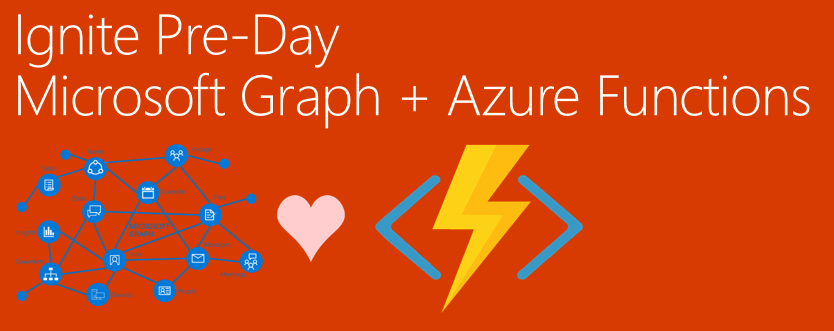

Microsoft Ignite PreDay Starter Project
=====

# Description
This repo is to assist,as a starting point, to your challenge for today's pre-day event. It helps jump start you past setting up AAD Applications for Auth, and it shows you examples of what you need to do get some useful data from the Graph.

# Steps to Get started
## Step 1 - Create your Azure Application
## Step 2 - Create your Function App in the Azure Portal
## Step 3 - Enable Beta Functionality of Function App.
### 
## Step 4 - Add your Azure Active Directory Application Details to Functions
## Step 5 - Create a new Azure Function for Microsoft Graph

# Microsoft Graph API Http Trigger Functions Ex1:
```csharp
using System.Net; 
using System.Net.Http; 
using System.Net.Http.Headers; 

public static async Task<HttpResponseMessage> Run(HttpRequestMessage req, string graphToken, TraceWriter log)
{
    log.Info("C# HTTP trigger function processed a request.");    
    HttpClient client = new HttpClient();
    client.DefaultRequestHeaders.Authorization = new AuthenticationHeaderValue("Bearer", graphToken);
    return await client.GetAsync("https://graph.microsoft.com/v1.0/me/");
}
```
# Microsoft Graph SDK Http Trigger Functions Ex1:
```csharp
#r "Newtonsoft.Json"
#r "Microsoft.Graph"
#r "D:\home\site\wwwroot\bin\Microsoft.Graph.Core.dll"
#r "System.Linq.Expressions"
using System.Net; 
using System.Net.Http; 
using System.Net.Http.Headers; 
using Microsoft.Graph;
using Newtonsoft.Json;
using System.Threading.Tasks;
// Welcome Ignite Pre Day - this example uses the Microsoft Graph SDK 
public static async Task<HttpResponseMessage> Run(HttpRequestMessage req, string graphToken, TraceWriter log)
{
	var _graphClient = new GraphServiceClient(
				"https://graph.microsoft.com/v1.0",
				new DelegateAuthenticationProvider(
					 async (requestMessage) =>
					{
						
						requestMessage.Headers.Authorization = new AuthenticationHeaderValue("bearer", graphToken);
					})
			);
	var values = await proxy.Me.MailFolders.Inbox.Messages.Request().Select("").Filter("ReceivedDateTime ge 2017-09-23 and hasAttachments eq true").Expand("Attachments").GetAsync();

    //you could wrao the GetAsync method with a Try/Catch and in the catch, return another HTTP status code, with whatever
    //error you want to send the system that is calling this HTTPTrigger
    HttpResponseMessage s = new HttpResponseMessage(System.Net.HttpStatusCode.OK);
    s.Content = new StringContent(JsonConvert.SerializeObject(values));
    return s;
}

```